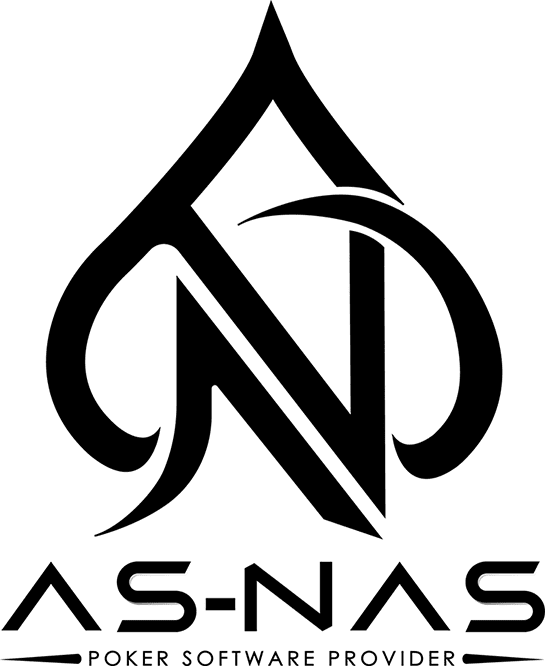

  

# ♠ AS-NAS — Poker Software & Infrastructure

> Build, launch, or automate your poker business with enterprise-grade technology.

---

### Who We Are

AS-NAS is a professional online poker and iGaming software company with **10+ years in the industry** and a team of **40+ experts**. We build the infrastructure operators rely on — white label platforms, poker robot AI, and B2B poker software — while constantly evolving with cutting-edge security and reliability.

Our team supports the poker community **24 hours a day, seven days a week**.

---

### Three Core Solutions

| Solution | Description | Learn More |
|----------|-------------|------------|
| **White Label Poker** | Launch your own fully branded poker business in 6–8 weeks. Custom branding, back-office, payments, and multi-platform deployment — all turnkey. | [Explore →](https://as-nas.com/whitelabel/) |
| **Poker Robot AI** | Adaptive, multi-platform automation built on probabilistic decision-making — not fixed scripts. Supports 8+ poker platforms. | [Explore →](https://as-nas.com/poker-robot-ai/) |
| **Buy Poker Software** | Buy, rent, or sell poker platforms. Full source code ownership, managed hosting, or brokerage services for exits. | [Explore →](https://as-nas.com/buy-poker-software/) |

---

### Platforms & Integrations

Our cross-platform codebase runs on **Desktop, iOS, Android, and WebGL** from a single source.

**Poker Robot AI supported platforms:**

BigCash · PPPoker · PokerBros · Pokerrrr 2 · X-Poker · Suprema Poker · FishPoker · ClubGG

---

### Why Operators Choose AS-NAS

- **Enterprise-Grade Security** — Anti-cheat and anti-collusion systems built into the platform layer, not bolted on afterward.
- **Cross-Platform Compatibility** — One codebase delivers native experiences across Desktop, iOS, Android, and WebGL.
- **24/7 Dedicated Support** — Deployment and support teams available around the clock with direct escalation for production issues.
- **Proven Track Record** — 10+ years of industry experience, 40+ team members, and round-the-clock coverage.

---

### Knowledge Hub

| Topic | Resource |
|-------|----------|
| About Us | [Our Story & Team](https://as-nas.com/about-us/) |
| White Label | [How It Works](https://as-nas.com/whitelabel/) |
| Poker Robot AI | [Technology & Platforms](https://as-nas.com/poker-robot-ai/) |
| Buy / Rent / Sell | [Platform Marketplace](https://as-nas.com/buy-poker-software/) |
| Blog | [Latest News & Guides](https://as-nas.com/category/blog/) |
| How to Play | [Strategy & Rules](https://as-nas.com/category/how-to-play/) |
| Get Started | [Contact Our Team](https://as-nas.com/contact-us/) |

---

### Get in Touch

Ready to talk about your poker business? Whether you want to **buy, rent, white label, or automate** — our team will help you find the right path.

→ [Contact Us](https://as-nas.com/contact-us/)

---

*AS-NAS — Building the infrastructure behind the world's poker operations since 2016.*